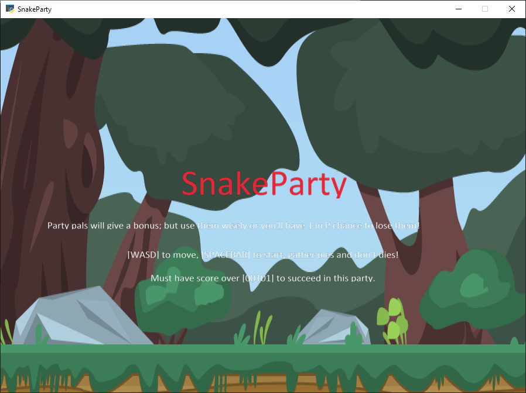
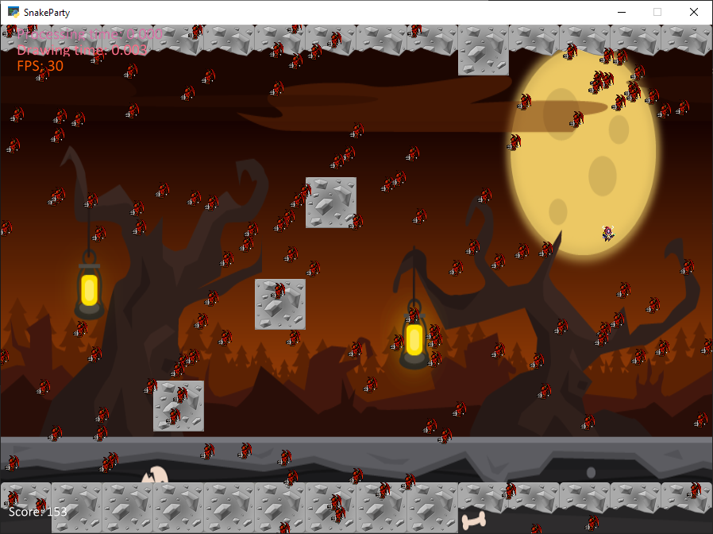
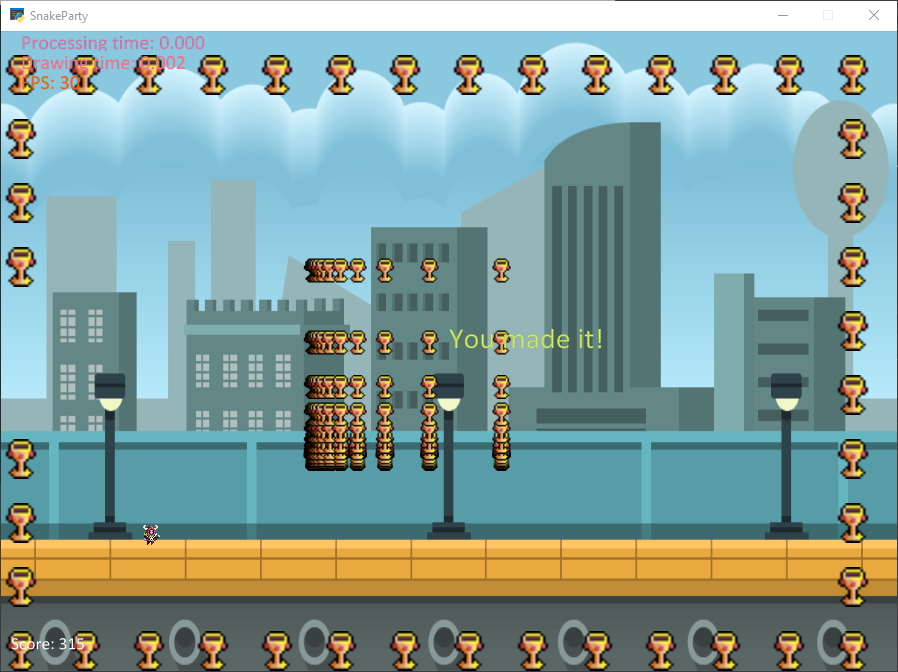

# SnakeParty-RPG
Python game involving puzzles and adventure. Mathematical!

## Game Features

- Keyboard movements : standard WASD, move any which way you like.
- Party members grant bonuses or special movesets, never adventure alone.
- Gather the prime amount of 101 Pi(e)s for your powerup.
- Avoid being poked by the flying demons! They steal your pies and kill your friends. :(
- Heal a while in the water nymph's palace, find the mirrors to leave.
- Be careful of falling into volcano traps, the demons haven't forgotten you or your Pi(e)s!
- Manage to make it back to town alive, the town will shower you with prizes for your hard-earned Pi(e)s.

### Fun concepts included!!! Reinforce your mind with discrete math.
Use your noodle!

- Number Conversion	: Mirror room puzzle (do something in other room of same value tag if converted) or stats calculator. 
- Prime Numbers/Cipher	: Locked room puzzle/drops/enemies movesets
- Set Theory	: Party set, inventory set, enemies set, stats set
- Permutations/Combinations	: Party permutation bonuses in certain scenarios/rooms (i.e. strong/weak against ...)
- Probability	: Probability of making it out alive in certain (battle/flee) scenarios
- Algorithms	: Binary sort, movement allotted in turn
- Recursion	: Attack system, directional system, validate commands
- Trees	: Inventory, things in room, party order sort
- Finite State Machine	: Mechanics of all, 'battle' and navigation system... moves, stats

### Upcoming
- Party members have individual stats, pick your favorites to adventure with!
- Party members will have different, individual movesets.
- Mirror room visual effects when healing effects activated.
* ...more coming soon...
